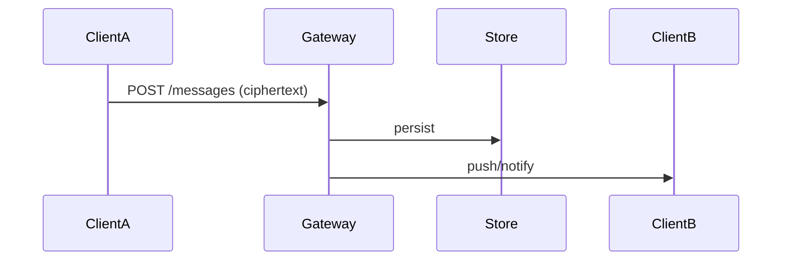

# Docs — Private Messenger
High-level design notes.
## Sequence (send message)

```mermaid
sequenceDiagram
  participant ClientA
  participant Gateway
  participant Store
  participant ClientB
  ClientA->>Gateway: POST /messages (ciphertext)
  Gateway->>Store: persist
  Gateway->>ClientB: push/notify
```
