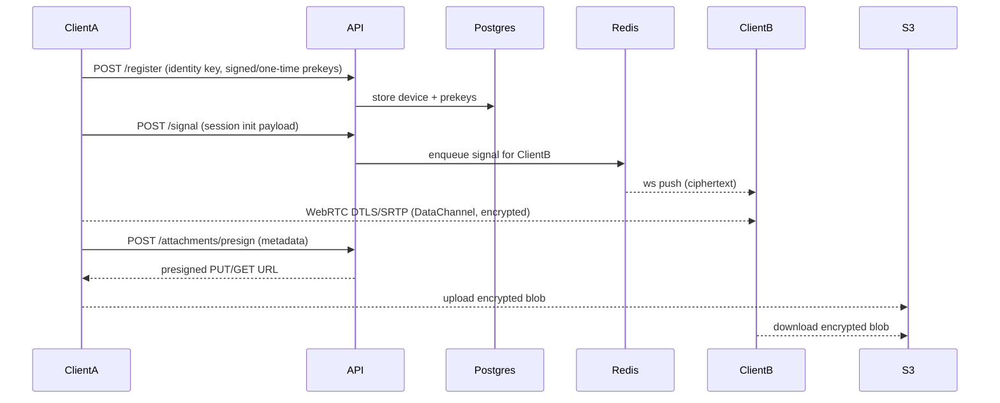

# Private Messenger — overview

## Sequence: device registration + message

## Components
- FastAPI (signaling, auth, presign).
- Redis pub/sub for WebSocket fanout.
- Postgres for users/devices/prekeys.
- TURN for relay fallback; WebRTC DataChannels for payloads.
